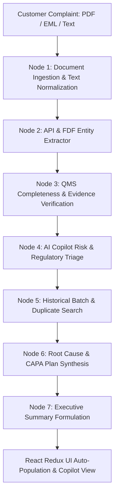

# AIVOA – AI-Powered Customer Complaint Management System
### Pharmaceutical API & FDF Quality Management System (QMS)

> Built for the **AIVOA Round 1 AI Product Engineer (Interns)** Assignment.  
> Compliant with **FDA 21 CFR Part 211.198**, **EU GMP Chapter 8**, and **ICH Q9 Quality Risk Management**.

---

## 📌 Project Overview

This system is an **AI-powered Pharmaceutical Customer Complaint Management System** tailored specifically for Active Pharmaceutical Ingredients (API) and Finished Dosage Form (FDF) manufacturing. 

It replicates and enhances the official reference UI and demo workflow:
1. **Intelligent Complaint Intake**: Accepts PDFs, EML emails, DOCX, and raw text narratives.
2. **LangGraph Multi-Stage Agent Workflow**:
   - **Node 1: Document Ingestion & Pharma NLP Preprocessing**
   - **Node 2: API & FDF Entity Extraction** (Extracts 12 structured fields: Product, Strength/Grade, Batch #, Mfg/Exp Dates, Quantity, Complaint Type, Severity, Priority, etc.)
   - **Node 3: QMS Completeness & Evidence Verification** (Scores intake 0-100%, flags missing batch records/sample returns/temp logs, and generates customer follow-up inquiries)
   - **Node 4: AI Copilot Risk & Regulatory Triage** (Calculates RPN = Severity × Occurrence × Detection, triggers FDA 3-day Field Alert Report vs 30-day investigation, classifies Health Hazard Class I/II/III)
   - **Node 5: Duplicate & Trend Searcher** (Scans historical database for matching batches, product lines, and defect modes with similarity scoring)
   - **Node 6: Root Cause & CAPA Synthesis** (Generates Ishikawa 5M1E Fishbone, 5-Whys deductive chain, immediate containment, and corrective/preventive actions with target dates and assignees)
   - **Node 7: Executive Summary Formulation**
3. **Interactive AI QMS Copilot Chat**: Enables live Q&A about the complaint, FDA/MHRA regulatory guidance, sample request email drafting, and containment protocols.
4. **QMS Complaints Repository & Audit Trail**: Full search, filtering by status/severity, status management, CSV export, and **1-Click 21 CFR Part 211 Compliant PDF Audit Report Generation**.

---

## 🛠️ Mandatory Technology Stack Alignment

| Layer | Requirement | Implemented Solution |
| :--- | :--- | :--- |
| **Frontend** | React UI with Redux | **React 18 + Redux Toolkit (`@reduxjs/toolkit`, `react-redux`) + Vite + Google Inter Font** |
| **Backend** | Python with FastAPI | **FastAPI + Uvicorn + Pydantic v2 + SQLAlchemy** |
| **AI Framework** | LangGraph | **LangGraph `StateGraph` with 7 sequential nodes and typed state** |
| **LLMs** | Groq (`gemma2-9b-it`, `llama-3.3-70b-versatile`) | **Groq Python SDK + fallback to resilient Pharma QMS Heuristic Engine** |
| **Database** | MySQL / Postgres / SQLite | **SQLAlchemy ORM with SQLite default (zero-setup) & PostgreSQL compatibility** |
| **Font** | Google Inter | **Google Fonts `Inter` integrated into typography & layout** |

---

## 🚀 Quick Start Guide

### 1. Prerequisites
- **Python 3.10+** (Tested on Python 3.13)
- **Node.js v18+** (Tested on Node v22)

---

### 2. Backend Setup & Run

```bash
# Navigate to backend directory
cd backend

# Install dependencies
pip install -r requirements.txt

# (Optional) Set your Groq API Key
# Either create a .env file or enter it directly in the UI settings modal
# GROQ_API_KEY=gsk_...
# GROQ_MODEL=gemma2-9b-it

# Run backend server (starts on http://127.0.0.1:8000)
uvicorn app.main:app --reload --port 8000
```

Verify backend health at: `http://127.0.0.1:8000/api/health`

---

### 3. Frontend Setup & Run

```bash
# Open a new terminal and navigate to frontend directory
cd frontend

# Install dependencies
npm install

# Start Vite development server (starts on http://localhost:3000)
npm run dev
```

Open your browser at `http://localhost:3000`.

---

## 🧪 Pre-Packaged Pharma Test Scenarios (1-Click Demo)

The system includes 4 realistic pharmaceutical complaint scenarios pre-built into the UI for instant evaluation:

1. **Amoxicillin 500mg Capsules (`.eml` Email)**:
   - *Complaint*: Blister seal leakage / foil delamination causing capsule powder yellowing.
   - *Outcome*: Extracts Batch `AMX-2024-019`, flags moisture ingress, evaluates Class II recall risk.
2. **Metformin HCl API (`.txt` Audit Report)**:
   - *Complaint*: Off-white to yellowish discoloration with 0.18% Related Substance A impurity.
   - *Outcome*: Extracts Batch `MET-API-884`, generates vacuum dryer overheating hypothesis.
3. **Heparin Sodium Injection 5000 IU/mL (`.pdf` Clinical Report)**:
   - *Complaint*: Foreign black particulate matter / rubber stopper coring in sterile ICU vials.
   - *Outcome*: Severity **Critical**, triggers **FDA 3-day Field Alert Report (FAR)**, RPN: 288.
4. **Atorvastatin Calcium 20mg Tablets (`.txt` Stability Notification)**:
   - *Complaint*: 45-min dissolution rate OOS failure (68% vs Q >= 80%).
   - *Outcome*: Extracts Batch `ATV-2024-301`, diagnoses 12-min lubricant over-blending.

---

## 🏗️ Architecture & LangGraph Workflow



---

## 🎥 5–10 Minute Demo Video Walkthrough Script

When recording your submission video, follow this recommended walkthrough:

1. **Introduction (1 min)**:
   - Introduce yourself and the objective: Building an AI-Powered Customer Complaint Management System for Pharmaceutical API & FDF manufacturing.
   - Show tech stack: React + Redux Toolkit (Frontend), FastAPI + SQLAlchemy (Backend), LangGraph + Groq `gemma2-9b-it` (AI workflow).
2. **Intake & Auto-Population Demonstration (2-3 min)**:
   - Click one of the 1-Click Pharma Test Samples (e.g., *Amoxicillin Blister EML* or *Heparin Particulate PDF*).
   - Show the animated extraction progress bar and explain the 6 LangGraph nodes executing in sequence.
   - Show how the 12 fields in Sections 1–4 of the "Log Customer Complaint" form are auto-filled with highlight animations.
3. **Quality Intelligence & Bonus Features (2-3 min)**:
   - **Completeness Checker**: Show the completeness score (e.g., 95%) and copy the 1-click generated customer follow-up inquiry email.
   - **Risk Assessment**: Explain the RPN matrix (Severity × Occurrence × Detection = 288) and FDA 21 CFR Part 211.198 / MHRA reporting alerts.
   - **Duplicate Detection**: Show how the system detected historical batch correlations in the database.
   - **Root Cause & CAPA**: Walk through the Ishikawa 5M1E fishbone cards and the Immediate Containment / Corrective / Preventive action plan.
4. **Interactive AI Copilot & Code Walkthrough (2-3 min)**:
   - Ask the AI Copilot: *"What is the regulatory reporting requirement for this batch?"* and show the contextual response.
   - Walk through the code:
     - Frontend: `ComplaintForm.tsx`, `AIIntakeAssistant.tsx`, `complaintSlice.ts` (Redux state).
     - Backend: `main.py`, `langgraph_agent.py` (StateGraph definition), `groq_llm.py` (`gemma2-9b-it` integration).
   - Click **Save Complaint** (show confetti & DB persistence) and **Export Audit PDF** (show FDA-ready PDF report).

---

## 📄 License & Attribution
Designed and built for AIVOA AI Product Engineer Internship assessment.
